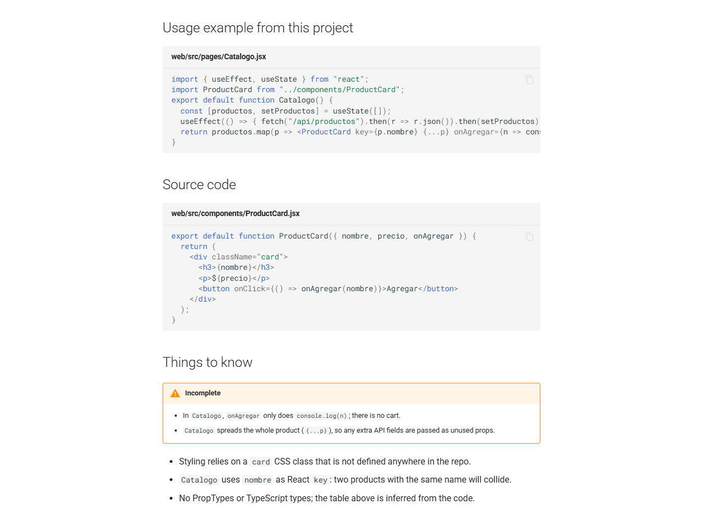
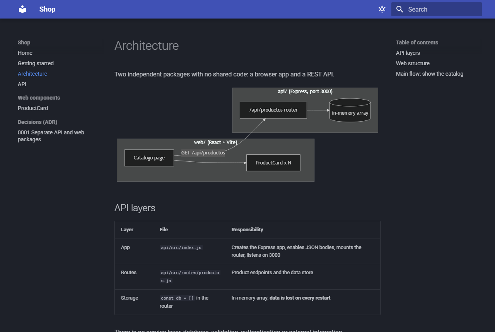

# Skills by Julio Varas

[](https://skills.sh/julvc/skills)
[
[](https://github.com/julvc/skills/actions/workflows/smoke.yml)

**English** · [Español](#español)

Agent skills I use on real projects. Small, readable, easy to adapt. They follow the open [Agent Skills](https://agentskills.io) format (`SKILL.md`), so they work in **Claude Code** first and also in **Codex, OpenCode, Antigravity, Gemini CLI** and other agents.

## Skills

| Skill                                            | What it does                                                                                                                                                                                                                                                                  |
| ------------------------------------------------ | ----------------------------------------------------------------------------------------------------------------------------------------------------------------------------------------------------------------------------------------------------------------------------- |
| [**SnapDoczilla**](skills/snapdoczilla/SKILL.md) | Documentation for **any backend and any frontend** as an offline HTML site inside your repo. Anyone reads it with a double click; any dev updates it with one command. Mermaid diagrams, API map, ADRs and react.dev-style component pages with **real code and real usage**. |

<p align="center">
  <br>
  <em>A component page generated by SnapDoczilla: real usage and real source, pulled from the repo on every build.</em>
</p>

## Installation (30-second setup)

Two options. The **Claude Code plugin** is a managed bundle that updates when I ship. **skills.sh** copies editable files into your project, for any agent. Pick one: installing both gives you every skill twice.

<details open>
<summary><strong>Claude Code (plugin)</strong></summary>

```bash
claude plugin marketplace add julvc/skills
claude plugin install snapdoczilla@juliovc
```

Or from inside a session:

```
/plugin marketplace add julvc/skills
/plugin install snapdoczilla@juliovc
```

Invoke it with `/snapdoczilla:snapdoczilla`, or just ask *"document this project"*: Claude picks it up on its own.

</details>

<details>
<summary><strong>Codex, OpenCode, Antigravity, Gemini CLI and other agents</strong></summary>

```bash
npx skills@latest add julvc/skills
```

Pick the skills and the agents to install them on. Or install one skill on one agent with no prompts:

```bash
npx skills@latest add julvc/skills --skill snapdoczilla -a codex -y
```

Agent ids: `claude-code`, `codex`, `opencode`, `antigravity`, `gemini-cli`. Add `-g` to install globally instead of in the current project.

</details>

<details>
<summary><strong>Manual (no tooling)</strong></summary>

Copy `skills/snapdoczilla/` into your agent's skills folder:

| Agent       | Project           | Global                          |
| ----------- | ----------------- | ------------------------------- |
| Claude Code | `.claude/skills/` | `~/.claude/skills/`             |
| Codex       | `.agents/skills/` | `~/.codex/skills/`              |
| OpenCode    | `.agents/skills/` | `~/.config/opencode/skills/`    |
| Antigravity | `.agents/skills/` | `~/.gemini/antigravity/skills/` |

</details>

## SnapDoczilla: step by step

**What you get:** a `documentation/` folder in your repo. Anyone opens `documentation/html/index.html` with a double click: search and diagrams included, no install, no internet. Docs can't drift from code: pages embed the real source files on every build. See a full result in [`examples/shop`](examples/shop) (an Express API + React app; download the repo and open `examples/shop/documentation/html/index.html`).

**Scope.** It documents what lives in the repo, for any stack: Spring, Node (Express/Nest), Python (FastAPI/Django/Flask), .NET, Go, PHP, Ruby; Vue, React, Angular, Svelte.

| Backend                                                                        | Frontend                                                                                | Any project                     |
| ------------------------------------------------------------------------------ | --------------------------------------------------------------------------------------- | ------------------------------- |
| Architecture with Mermaid flows, API map by resource, integrations, data model | Screens/routes, `src/` structure, state, component pages (API + real usage + real code) | Overview, getting started, ADRs |

It does **not** take screenshots, run live demos, host anything or replace your OpenAPI/Swagger. Docs are written in the language you choose (English by default).

**Requirements.** To read: a browser. To generate/update: Git (with bash; on Windows, Git for Windows), Python 3 and an agent.

### 1. Install the skill
See [Installation](#installation-30-second-setup).

### 2. Ask your agent, inside your repo

```
Document this project
```

The agent detects your areas (e.g. `back=backend/`, `front=frontend/`), installs the scaffolding, writes the first pages from your real code, builds the site and checks the diagrams. It never commits.

### 3. Read it
Open `documentation/html/index.html`.

### 4. Review and commit
Check `git diff`, fix anything flagged as *to be confirmed* and commit `documentation/` (including `html/`, so readers need nothing installed).

### 5. Keep it updated (any dev, one command)

```bash
./documentation/update.sh              # all areas
./documentation/update.sh --front      # one area
./documentation/update.sh --html-only  # rebuild the HTML only, after editing .md by hand
```

On Windows, double-click `documentation\update.cmd`. Only what changed since the last sync goes to the agent. A `pre-push` hook reminds you (never blocks) when code changed without docs.

Claude Code is the default. Using another agent? Set `DOCS_LLM`:

| Agent      | `DOCS_LLM`               |
| ---------- | ------------------------ |
| Codex CLI  | `codex exec --full-auto` |
| OpenCode   | `opencode run`           |
| Gemini CLI | `gemini --yolo -p`       |

Or ask your agent *"update the docs"* inside a session. That works with every agent, Antigravity included.

### 6. Document a component

```
Add a SnapDoczilla page for the Button component
```

You get what it is, how it works, props/events/slots, a **real usage example** from your app and the **real source code**.

<p align="center">
  <br>
  <em>Architecture page, dark mode, diagram rendered offline.</em>
</p>

## SnapDoczilla or Docusaurus?

They solve different problems. [Docusaurus](https://docusaurus.io) is an engine to build a site you write by hand. SnapDoczilla is a workflow: your agent writes the docs from the code and keeps them in sync.

|                                       | Docusaurus       | SnapDoczilla                                                 |
| ------------------------------------- | ---------------- | ------------------------------------------------------------ |
| Who writes                            | You              | Your agent, from the real code                               |
| Staying current                       | Manual           | Incremental, per git diff; code embedded from the real files |
| Read without a server                 | No               | Yes, double-click                                            |
| Stack                                 | Node, React, MDX | Python only to build; nothing to read                        |
| Versions, multi-locale, blog, plugins | Yes              | No                                                           |

Pick **Docusaurus** for a public product site with versions and many languages. Pick **SnapDoczilla** to make any codebase understandable to your team, today, and keep it that way.

## Publish on the web (optional)

`documentation/html/` is a static site. To serve it with GitHub Pages, add `.github/workflows/docs.yml` to your repo and set *Settings → Pages → Source* to **GitHub Actions**:

```yaml
name: docs
on:
  push:
    branches: [main]
    paths: [documentation/html/**]
permissions: { contents: read, pages: write, id-token: write }
jobs:
  deploy:
    runs-on: ubuntu-latest
    environment: github-pages
    steps:
      - uses: actions/checkout@v4
      - uses: actions/upload-pages-artifact@v3
        with: { path: documentation/html }
      - uses: actions/deploy-pages@v4
```

## What gets added to your repo

```
documentation/
├── source/              # editable Markdown (the agent writes here)
│   └── assets/          # local mermaid.min.js + diagrams.js
├── html/                # generated site (committed: zero-setup reading)
├── mkdocs.yml
├── areas.conf           # code areas: name=path
├── AGENT-RULES.md       # rules for the agent (language, never invent, format)
├── AGENT-RULES-<area>.md  # per-area rules (e.g. component pages)
├── update.sh / .cmd     # the only command you need
├── requirements.txt     # mkdocs<2, mkdocs-material<10
└── .last-sync-<area>    # last documented commit per area
.githooks/pre-push       # reminder only, never blocks
```

## Adding a new skill to this repo

1. Create `skills/<skill-name>/SKILL.md` with `name` and `description` frontmatter (the description decides when agents trigger it). Helpers go next to it: `scripts/`, `assets/`, `references/`.
2. Claude Code: add a plugin for it in `.claude-plugin/marketplace.json` (one plugin per skill, all under the `juliovc` marketplace). When there are two or more, give each one its own folder with a `.claude-plugin/plugin.json` and point `source` at it.
3. Check: `claude plugin validate .`, `npx skills@latest add . --list` and `bash tests/smoke.sh` (CI runs it on every push and PR).
4. Add a row to the [Skills](#skills) table, in both languages.

## Contributing

Issues and PRs welcome. Run `bash tests/smoke.sh` before opening a PR. Ideas for SnapDoczilla: a no-Python option, per-framework component templates, detecting drifted line-range snippets.

## License

LICENSE © Julio Varas

---

## Español

[English](#skills-by-julio-varas) · **Español**

Skills para agentes que uso en proyectos reales. Pequeñas, legibles y fáciles de adaptar. Siguen el formato abierto [Agent Skills](https://agentskills.io) (`SKILL.md`): funcionan primero en **Claude Code** y también en **Codex, OpenCode, Antigravity, Gemini CLI** y otros agentes.

### Skills

| Skill                                            | Qué hace                                                                                                                                                                                                                                                                                                             |
| ------------------------------------------------ | -------------------------------------------------------------------------------------------------------------------------------------------------------------------------------------------------------------------------------------------------------------------------------------------------------------------- |
| [**SnapDoczilla**](skills/snapdoczilla/SKILL.md) | Documentación para **cualquier backend y cualquier frontend** como un sitio HTML offline dentro de tu repo. Cualquier persona la lee con doble clic y cualquier dev la actualiza con un comando. Diagramas Mermaid, mapa de la API, ADRs y fichas de componentes al estilo react.dev con **código real y uso real**. |

<p align="center">
  <br>
  <em>Ficha de componente generada por SnapDoczilla: uso y código reales, tomados del repo en cada build.</em>
</p>

### Instalación (30 segundos)

Dos opciones. El **plugin de Claude Code** es un paquete administrado que se actualiza cuando publico. **skills.sh** copia archivos editables en tu proyecto, para cualquier agente. Elige una: si instalas las dos, tendrás cada skill duplicada.

<details open>
<summary><strong>Claude Code (plugin)</strong></summary>

```bash
claude plugin marketplace add julvc/skills
claude plugin install snapdoczilla@juliovc
```

O dentro de una sesión:

```
/plugin marketplace add julvc/skills
/plugin install snapdoczilla@juliovc
```

Se invoca con `/snapdoczilla:snapdoczilla`, o simplemente pidiendo *"documenta este proyecto"*: Claude la activa solo.

</details>

<details>
<summary><strong>Codex, OpenCode, Antigravity, Gemini CLI y otros agentes</strong></summary>

```bash
npx skills@latest add julvc/skills
```

Elige las skills y los agentes donde instalarlas. O instala una skill en un agente sin preguntas:

```bash
npx skills@latest add julvc/skills --skill snapdoczilla -a codex -y
```

Ids de agentes: `claude-code`, `codex`, `opencode`, `antigravity`, `gemini-cli`. Agrega `-g` para instalarla de forma global en vez de solo en el proyecto actual.

</details>

<details>
<summary><strong>Manual (sin herramientas)</strong></summary>

Copia `skills/snapdoczilla/` en la carpeta de skills de tu agente:

| Agente      | Proyecto          | Global                          |
| ----------- | ----------------- | ------------------------------- |
| Claude Code | `.claude/skills/` | `~/.claude/skills/`             |
| Codex       | `.agents/skills/` | `~/.codex/skills/`              |
| OpenCode    | `.agents/skills/` | `~/.config/opencode/skills/`    |
| Antigravity | `.agents/skills/` | `~/.gemini/antigravity/skills/` |

</details>

### SnapDoczilla: paso a paso

**Qué obtienes:** una carpeta `documentation/` en tu repo. Cualquier persona abre `documentation/html/index.html` con doble clic: trae búsqueda y diagramas, sin instalar nada y sin internet. La documentación no se desfasa del código, porque las páginas incluyen los archivos fuente reales en cada build. Hay un resultado completo en [`examples/shop`](examples/shop) (una API Express + una app React): descarga el repo y abre `examples/shop/documentation/html/index.html`.

**Alcance.** Documenta lo que está en el repo, en cualquier stack: Spring, Node (Express/Nest), Python (FastAPI/Django/Flask), .NET, Go, PHP, Ruby; Vue, React, Angular, Svelte.

| Backend                                                                                     | Frontend                                                                                              | Cualquier proyecto            |
| ------------------------------------------------------------------------------------------- | ----------------------------------------------------------------------------------------------------- | ----------------------------- |
| Arquitectura con flujos Mermaid, mapa de la API por recurso, integraciones, modelo de datos | Pantallas y rutas, estructura de `src/`, estado, fichas de componentes (API + uso real + código real) | Resumen, primeros pasos, ADRs |

**No** saca capturas, no hace demos vivas, no publica en ningún servidor y no reemplaza tu OpenAPI/Swagger. La documentación se escribe en el idioma que elijas (inglés por defecto; si le hablas al agente en español, la escribe en español).

**Requisitos.** Para leer: un navegador. Para generar o actualizar: Git (con bash; en Windows, Git for Windows), Python 3 y un agente.

#### 1. Instala la skill
Ver [Instalación](#instalación-30-segundos).

#### 2. Pídeselo a tu agente, dentro de tu repo

```
Documenta este proyecto
```

El agente detecta tus áreas (por ejemplo `back=backend/`, `front=frontend/`), instala la estructura, escribe las primeras páginas a partir de tu código real, construye el sitio y revisa los diagramas. Nunca hace commit.

#### 3. Léela
Abre `documentation/html/index.html`.

#### 4. Revisa y haz commit
Revisa el `git diff`, corrige lo marcado como *por confirmar* y haz commit de `documentation/`. Incluye `html/`, para que quien la lea no tenga que instalar nada.

#### 5. Mantenla al día (cualquier dev, un comando)

```bash
./documentation/update.sh              # todas las áreas
./documentation/update.sh --front      # una sola área
./documentation/update.sh --html-only  # solo regenera el HTML, tras editar los .md a mano
```

En Windows, doble clic en `documentation\update.cmd`. Al agente solo le llega lo que cambió desde la última sincronización. Un hook `pre-push` te avisa (nunca bloquea) cuando hay cambios de código sin documentar.

Por defecto usa Claude Code. ¿Usas otro agente? Define `DOCS_LLM`:

| Agente     | `DOCS_LLM`               |
| ---------- | ------------------------ |
| Codex CLI  | `codex exec --full-auto` |
| OpenCode   | `opencode run`           |
| Gemini CLI | `gemini --yolo -p`       |

O pídele a tu agente *"actualiza la documentación"* dentro de una sesión. Funciona con todos, incluido Antigravity.

#### 6. Documenta un componente

```
Agrega una ficha de SnapDoczilla para el componente Boton
```

Obtienes qué es, cómo funciona, props/eventos/slots, un **ejemplo de uso real** de tu aplicación y el **código fuente real**.

### ¿SnapDoczilla o Docusaurus?

Resuelven problemas distintos. [Docusaurus](https://docusaurus.io) es un motor para construir un sitio que escribes a mano. SnapDoczilla es un flujo de trabajo: tu agente escribe la documentación desde el código y la mantiene sincronizada.

|                                          | Docusaurus       | SnapDoczilla                                                              |
| ---------------------------------------- | ---------------- | ------------------------------------------------------------------------- |
| Quién escribe                            | Tú               | Tu agente, desde el código real                                           |
| Mantenerla al día                        | A mano           | Incremental, por git diff; el código se incluye desde los archivos reales |
| Leer sin servidor                        | No               | Sí, con doble clic                                                        |
| Stack                                    | Node, React, MDX | Python solo para construir; nada para leer                                |
| Versiones, varios idiomas, blog, plugins | Sí               | No                                                                        |

Elige **Docusaurus** para un sitio público de producto con versiones y varios idiomas. Elige **SnapDoczilla** para que cualquier código sea entendible para tu equipo, hoy, y siga siéndolo.

### Publicar en la web (opcional)

`documentation/html/` es un sitio estático. Para servirlo con GitHub Pages, usa el workflow de la sección [Publish on the web](#publish-on-the-web-optional) y configura *Settings → Pages → Source* en **GitHub Actions**.

### Qué se agrega a tu repo

```
documentation/
├── source/              # Markdown editable (aquí escribe el agente)
│   └── assets/          # mermaid.min.js local + diagrams.js
├── html/                # sitio generado (se commitea: se lee sin instalar nada)
├── mkdocs.yml
├── areas.conf           # áreas de código: nombre=ruta
├── AGENT-RULES.md       # reglas para el agente (idioma, no inventar, formato)
├── AGENT-RULES-<area>.md  # reglas por área (p. ej. fichas de componentes)
├── update.sh / .cmd     # el único comando que necesitas
├── requirements.txt     # mkdocs<2, mkdocs-material<10
└── .last-sync-<area>    # último commit documentado por área
.githooks/pre-push       # solo avisa, nunca bloquea
```

### Agregar una skill nueva a este repo

1. Crea `skills/<nombre-skill>/SKILL.md` con el frontmatter `name` y `description` (la descripción define cuándo la activan los agentes). Los archivos de apoyo van al lado: `scripts/`, `assets/`, `references/`.
2. Claude Code: agrega un plugin para ella en `.claude-plugin/marketplace.json` (un plugin por skill, todos bajo el marketplace `juliovc`). Cuando haya dos o más, dale a cada una su propia carpeta con un `.claude-plugin/plugin.json` y apunta `source` a esa carpeta.
3. Verifica: `claude plugin validate .`, `npx skills@latest add . --list` y `bash tests/smoke.sh` (el CI la corre en cada push y PR).
4. Agrega una fila a la tabla de [Skills](#skills-1), en los dos idiomas.

### Contribuir

Issues y PR son bienvenidos. Corre `bash tests/smoke.sh` antes de abrir un PR. Ideas para SnapDoczilla: una opción sin Python, plantillas de fichas por framework y detectar snippets con rangos de líneas desfasados.

### Licencia

LICENSE © Julio Varas
