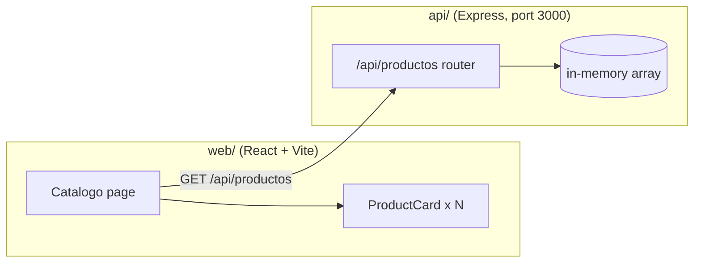
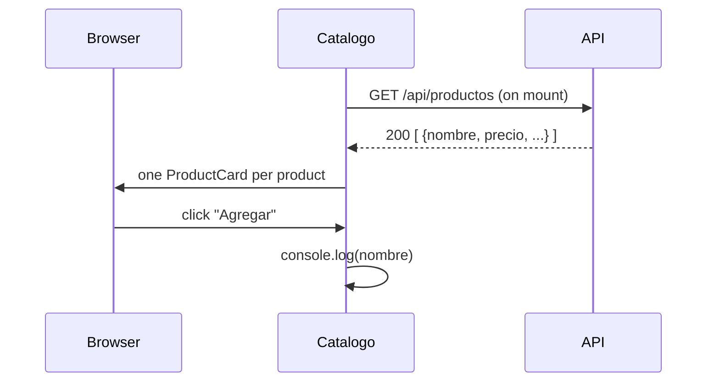

# Architecture

Two independent packages with no shared code: a browser app and a REST API.

## API layers

| Layer | File | Responsibility |
|---|---|---|
| App | `api/src/index.js` | Creates the Express app, enables JSON bodies, mounts the router, listens on 3000 |
| Routes | `api/src/routes/productos.js` | Product endpoints and the data store |
| Storage | `const db = []` in the router | In-memory array; **data is lost on every restart** |

There is no service layer, database, validation, authentication or external integration.

## Web structure

| Path | Role |
|---|---|
| `web/src/pages/Catalogo.jsx` | Page: loads products once and renders one card each |
| `web/src/components/ProductCard.jsx` | Presentational card: [ProductCard](web/ProductCard.md) |

State is local component state (`useState`); there is no global store or router.

## Main flow: show the catalog

> ⚠️ "Agregar" (add) only logs the product name. No cart exists yet.
