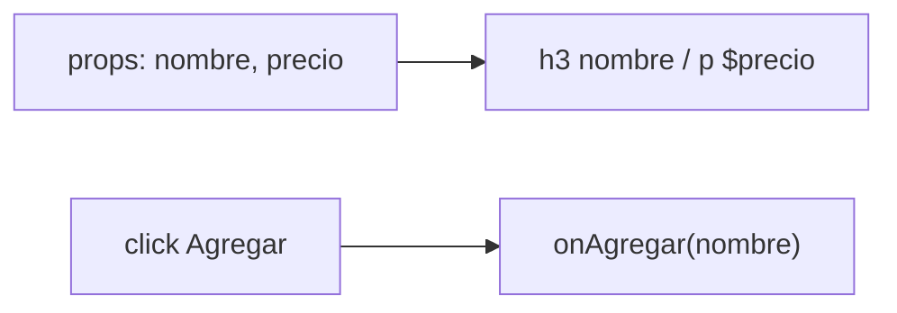

# ProductCard

## What it is and what it's for

A card that shows one product: its name, its price and an **Agregar** (Add) button. It appears on the catalog page (`Catalogo`), once per product returned by the API.

## How it works



- Purely presentational: no state, no effects, no API calls.
- The price is printed as `$` + the raw value; no number or currency formatting.
- Clicking the button calls `onAgregar` with the product **name** (not the whole product).

## Component API

### Props

| Name | Type | Default | Description |
|---|---|---|---|
| `nombre` | string | — | Product name; shown as title and passed to `onAgregar` |
| `precio` | number \| string | — | Price, shown after a `$` sign |
| `onAgregar` | `(nombre: string) => void` | — | Called on button click. **Required**: if missing, clicking throws |

### Events

None besides the `onAgregar` callback.

### Children

Not supported (`children` is ignored).

## Usage example from this project

```jsx title="web/src/pages/Catalogo.jsx"
--8<-- "web/src/pages/Catalogo.jsx"
```

## Source code

```jsx title="web/src/components/ProductCard.jsx"
--8<-- "web/src/components/ProductCard.jsx"
```

## Things to know

!!! warning "Incomplete"
    - In `Catalogo`, `onAgregar` only does `console.log(n)`; there is no cart.
    - `Catalogo` spreads the whole product (`{...p}`), so any extra API fields are passed as unused props.

- Styling relies on a `card` CSS class that is not defined anywhere in the repo.
- `Catalogo` uses `nombre` as React `key`: two products with the same name will collide.
- No PropTypes or TypeScript types; the table above is inferred from the code.
